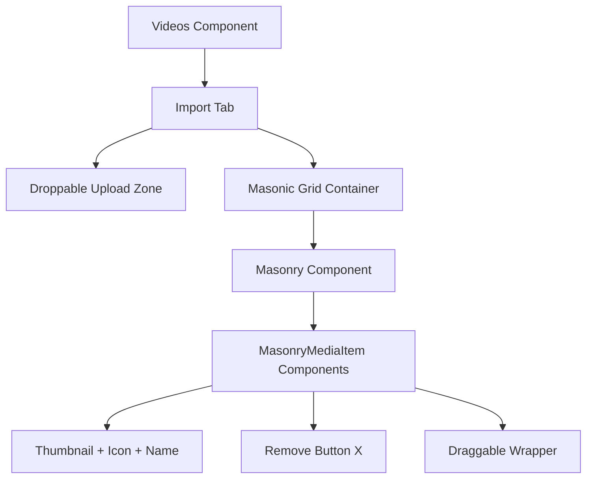

# Plan d'implémentation de Masonic dans l'onglet Import

## 📋 Vue d'ensemble

L'objectif est de remplacer la grille CSS actuelle (`.media-grid`) par une grille Masonic dans l'onglet "import" pour :
- Obtenir un agencement en maçonnerie optimisé
- Conserver le style visuel existant (icônes à droite, noms avec ellipsis)
- Tester l'ajout/suppression d'éléments
- Vérifier l'adaptation du scroll

## 🎯 Objectifs techniques

1. **Installation** : Ajouter `masonic` via NPM
2. **Configuration** : 2 colonnes avec largeur de 120px (comme actuellement)
3. **Style** : Conserver l'apparence actuelle avec icônes et noms de fichiers
4. **Performance** : Virtualisation pour de grandes listes
5. **Tests** : Ajout/suppression dynamique d'éléments

## 🏗️ Architecture proposée



## 📦 Étapes d'implémentation

### 1. Installation des dépendances
```bash
npm install masonic
```

### 2. Création du composant MasonryMediaGrid
- Nouveau composant dédié utilisant Masonic
- Configuration : `columnWidth={120}`, `columnGutter={8}`
- Rendu des items avec le style existant

### 3. Composant MasonryMediaItem 
- Reprendre la logique de `MediaItem` actuelle
- Adapter pour l'interface de Masonic
- Conserver : thumbnail, icône, nom avec ellipsis, bouton X

### 4. Intégration dans Videos.tsx
- Remplacer `.media-grid` par `<MasonryMediaGrid>`
- Conserver toute la logique existante (upload, remove, etc.)

### 5. Ajustements CSS
- Styles spécifiques pour Masonic
- Conservation des styles `.media-item-container` et `.media-remove-button`
- Ajout du style pour les noms de fichiers avec ellipsis

## 📝 Spécifications détaillées

### Configuration Masonic
```typescript
<Masonry
  items={importedMedia}
  columnWidth={120}
  columnGutter={8}
  rowGutter={8}
  render={MasonryMediaItem}
  overscanBy={2}
/>
```

### Structure du composant item
```typescript
interface MasonryMediaItemProps {
  index: number;
  data: ImportedMedia;
  width: number;
}
```

### Style des noms de fichiers
- Police : 12px
- Une seule ligne avec `text-overflow: ellipsis`
- Largeur maximale : largeur de la colonne (120px)
- Couleur : text-muted-foreground

## 🎨 Préservation du design existuel

1. **Thumbnails** : 80x80px avec `object-cover`
2. **Icônes** : Positionnement en bas à droite (Video/Audio/Image)
3. **Bouton X** : Apparition au hover, style rouge
4. **Drag & Drop** : Conservation complète de la fonctionnalité
5. **Double-click** : Ajout à la timeline

## 🧪 Tests à effectuer

1. **Ajout de médias** : Upload multiple, génération des thumbnails
2. **Suppression** : Bouton X, animation de disparition
3. **Scroll** : Performance avec de nombreux éléments
4. **Responsive** : Adaptation à la largeur du panneau
5. **Drag & Drop** : Vers la timeline, préview personnalisé

## 📂 Fichiers à modifier

1. **package.json** : Ajout de `masonic`
2. **src/features/editor/menu-item/videos.tsx** : Composants Masonry
3. **src/index.css** : Styles pour les noms de fichiers
4. **Optionnel** : Composant séparé pour la grille Masonry

## 🔍 Points d'attention

1. **Performance** : Masonic gère la virtualisation automatiquement
2. **Types TypeScript** : Interfaces pour les props Masonic
3. **Fallback** : Gérer le cas où `importedMedia` est vide
4. **Mémoire** : Nettoyage des URLs d'objets lors de la suppression

## 📊 Critères de succès

- ✅ Installation sans conflit de dépendances
- ✅ Grille en 2 colonnes avec agencement Masonry
- ✅ Conservation du style visuel existant
- ✅ Fonctionnalité drag & drop préservée
- ✅ Performance fluide avec 20+ éléments
- ✅ Ajout/suppression dynamique fonctionnel

## 🚀 Exemple d'implémentation

### Code Masonic basique
```typescript
import { Masonry } from "masonic";

const MasonryMediaGrid = ({ items, onAddMedia, onRemove, shouldDisplayPreview }) => {
  return (
    <div className="px-4 pb-4 mt-4">
      <Masonry
        items={items}
        columnWidth={120}
        columnGutter={8}
        rowGutter={8}
        render={MasonryMediaItem}
        overscanBy={2}
      />
    </div>
  );
};

const MasonryMediaItem = ({ index, data, width }) => {
  // Logique du MediaItem actuel adaptée pour Masonic
  return (
    <div style={{ width }}>
      {/* Contenu du média avec nom de fichier */}
    </div>
  );
};
```

### Styles CSS pour les noms
```css
.masonic-media-item {
  display: flex;
  flex-direction: column;
  gap: 4px;
}

.masonic-media-name {
  font-size: 14px;
  color: var(--muted-foreground);
  overflow: hidden;
  text-overflow: ellipsis;
  white-space: nowrap;
  max-width: 100%;
}