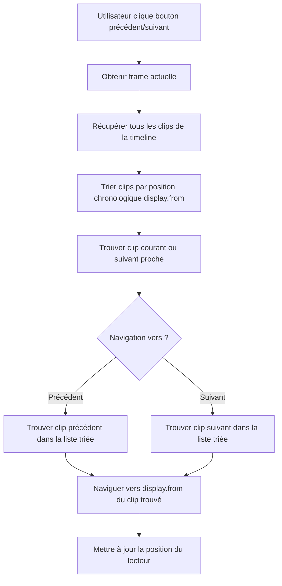

# Plan Détaillé : Navigation entre Clips dans l'Éditeur Vidéo

## 📋 Analyse du Problème

**Problème identifié :**
- Les boutons précédent/suivant dans [`src/features/editor/timeline/header.tsx`](src/features/editor/timeline/header.tsx:271-292) appellent actuellement :
  - Bouton précédent (ligne 271) : [`doActiveDelete`](src/features/editor/timeline/header.tsx:271) 
  - Bouton suivant (ligne 290) : [`doActiveSplit`](src/features/editor/timeline/header.tsx:290)

**Comportement souhaité :**
- Navigation chronologique entre tous les clips de toutes les pistes
- Bouton précédent : Positionnement exact au début du clip précédent (`display.from`)
- Bouton suivant : Positionnement exact à la fin du clip suivant (`display.to`)
- Boutons avec icônes flèche + barre (déjà implémentées : [`IconPlayerSkipBack`](src/features/editor/timeline/header.tsx:50-65) et [`IconPlayerSkipForward`](src/features/editor/timeline/header.tsx:67-82))

## 🏗️ Architecture de la Solution

### Diagramme de flux de la navigation



### Structure des données

```mermaid
classDiagram
    class ITrackItem {
        +id: string
        +display: {from: number, to: number}
        +type: string
    }
    
    class NavigationUtils {
        +getAllClipsSorted(): ITrackItem[]
        +findCurrentClip(currentTime: number): ITrackItem
        +findPreviousClip(currentClip: ITrackItem): ITrackItem
        +findNextClip(currentClip: ITrackItem): ITrackItem
        +navigateToClip(clip: ITrackItem): void
    }
    
    class TimelineHeader {
        +handlePreviousClip(): void
        +handleNextClip(): void
    }
    
    NavigationUtils --> ITrackItem
    TimelineHeader --> NavigationUtils
```

## 📂 Fichiers à Modifier/Créer

### 1. **Créer** : `src/features/editor/utils/clip-navigation.ts`
**Rôle :** Utilitaires pour la navigation entre clips

**Fonctionnalités :**
- `getAllClipsSorted()` : Récupère tous les clips triés par `display.from`
- `findCurrentClip()` : Trouve le clip actuel basé sur la frame courante
- `findPreviousClip()` : Trouve le clip précédent
- `findNextClip()` : Trouve le clip suivant
- `navigateToClip()` : Navigue vers un clip spécifique

### 2. **Modifier** : `src/features/editor/timeline/header.tsx`
**Changements :**
- Remplacer les fonctions `doActiveDelete` et `doActiveSplit` sur les boutons de navigation
- Implémenter `handlePreviousClip()` et `handleNextClip()`
- Importer et utiliser les utilitaires de navigation

## 🔧 Implémentation Détaillée

### Étape 1 : Créer les utilitaires de navigation

```typescript
// src/features/editor/utils/clip-navigation.ts
import { ITrackItem } from "@designcombo/types";
import { PlayerRef } from "@remotion/player";

export interface ClipNavigationData {
  trackItemsMap: Record<string, ITrackItem>;
  trackItemIds: string[];
  fps: number;
  playerRef: React.RefObject<PlayerRef> | null;
}

export const getAllClipsSorted = (data: ClipNavigationData): ITrackItem[] => {
  // Récupérer tous les clips et les trier par display.from
  const clips = data.trackItemIds
    .map(id => data.trackItemsMap[id])
    .filter(Boolean)
    .sort((a, b) => a.display.from - b.display.from);
  
  return clips;
};

export const findCurrentClip = (
  clips: ITrackItem[], 
  currentTimeMs: number
): ITrackItem | null => {
  // Trouver le clip qui contient le temps actuel
  return clips.find(clip => 
    currentTimeMs >= clip.display.from && 
    currentTimeMs <= clip.display.to
  ) || null;
};

export const findPreviousClip = (
  clips: ITrackItem[], 
  currentTimeMs: number
): ITrackItem | null => {
  // Trouver le clip précédent
  const currentIndex = clips.findIndex(clip => 
    currentTimeMs >= clip.display.from && currentTimeMs <= clip.display.to
  );
  
  if (currentIndex > 0) {
    return clips[currentIndex - 1];
  }
  
  // Si pas de clip courant, trouver le dernier clip avant la position actuelle
  const previousClips = clips.filter(clip => clip.display.from < currentTimeMs);
  return previousClips[previousClips.length - 1] || null;
};

export const findNextClip = (
  clips: ITrackItem[], 
  currentTimeMs: number
): ITrackItem | null => {
  // Trouver le clip suivant
  const currentIndex = clips.findIndex(clip => 
    currentTimeMs >= clip.display.from && currentTimeMs <= clip.display.to
  );
  
  if (currentIndex !== -1 && currentIndex < clips.length - 1) {
    return clips[currentIndex + 1];
  }
  
  // Si pas de clip courant, trouver le premier clip après la position actuelle
  return clips.find(clip => clip.display.from > currentTimeMs) || null;
};

export const navigateToClip = (
  clip: ITrackItem, 
  fps: number, 
  playerRef: React.RefObject<PlayerRef> | null
): void => {
  if (!playerRef?.current) return;
  
  // Convertir le temps en millisecondes vers frame
  const targetFrame = (clip.display.from / 1000) * fps;
  playerRef.current.seekTo(targetFrame);
};
```

### Étape 2 : Modifier le header de la timeline

```typescript
// Modifications dans src/features/editor/timeline/header.tsx

// Import à ajouter
import { 
  getAllClipsSorted, 
  findPreviousClip, 
  findNextClip, 
  navigateToClip 
} from "../utils/clip-navigation";

// Nouvelles fonctions à ajouter dans le composant Header
const handlePreviousClip = () => {
  if (!playerRef?.current) return;
  
  const currentTimeMs = (currentFrame / fps) * 1000;
  const clips = getAllClipsSorted({
    trackItemsMap,
    trackItemIds,
    fps,
    playerRef
  });
  
  const previousClip = findPreviousClip(clips, currentTimeMs);
  if (previousClip) {
    navigateToClip(previousClip, fps, playerRef);
  }
};

const handleNextClip = () => {
  if (!playerRef?.current) return;
  
  const currentTimeMs = (currentFrame / fps) * 1000;
  const clips = getAllClipsSorted({
    trackItemsMap,
    trackItemIds,
    fps,
    playerRef
  });
  
  const nextClip = findNextClip(clips, currentTimeMs);
  if (nextClip) {
    navigateToClip(nextClip, fps, playerRef);
  }
};

// Remplacer dans le JSX (lignes 271-292)
<Button onClick={handlePreviousClip} variant={"ghost"} size={"icon"}>
  <IconPlayerSkipBack size={14} />
</Button>
<Button
  onClick={() => {
    if (playing) {
      return handlePause();
    }
    handlePlay();
  }}
  variant={"ghost"}
  size={"icon"}
>
  {playing ? (
    <IconPlayerPauseFilled size={14} />
  ) : (
    <IconPlayerPlayFilled size={14} />
  )}
</Button>
<Button onClick={handleNextClip} variant={"ghost"} size={"icon"}>
  <IconPlayerSkipForward size={14} />
</Button>
```

### Étape 3 : Ajout des dépendances nécessaires

```typescript
// Dans le composant Header, ajouter aux imports du store :
const { 
  duration, 
  fps, 
  scale, 
  playerRef, 
  activeIds, 
  trackItemDetailsMap, 
  trackItemsMap,    // ← Ajouter
  trackItemIds,     // ← Ajouter 
  size 
} = useStore();
```

## 🧪 Tests et Comportements Attendus

### Cas de test
1. **Navigation normale** : Cliquer précédent/suivant navigue entre clips adjacents
2. **Début de timeline** : Bouton précédent au début ne fait rien ou va au premier clip
3. **Fin de timeline** : Bouton suivant à la fin ne fait rien ou va au dernier clip
4. **Clips non contigus** : Navigation fonctionne même avec espaces entre clips
5. **Plusieurs pistes** : Navigation considère tous les clips de toutes les pistes

### Améliorations futures possibles
- Feedback visuel quand il n'y a pas de clip précédent/suivant
- Navigation par raccourcis clavier
- Sélection automatique du clip vers lequel on navigue
- Animation de transition fluide

## 📝 Résumé des Modifications

**Fichiers créés :**
- `src/features/editor/utils/clip-navigation.ts`

**Fichiers modifiés :**
- `src/features/editor/timeline/header.tsx` (remplacement des gestionnaires d'événements des boutons)

**Fonctionnalités ajoutées :**
- Navigation chronologique entre clips
- Positionnement précis au début des clips
- Support multi-pistes

Ce plan respecte l'architecture existante et utilise les composants et utilitaires déjà en place. La solution est modulaire et facilement extensible.