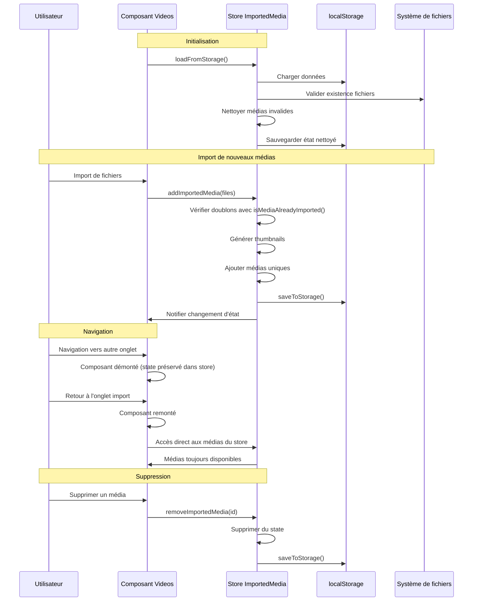

# Plan de Solution : Persistance des Médias Importés

## Problème Identifié

### Problème Principal
Les médias importés disparaissent lors de la navigation entre les onglets du panneau latéral car ils sont stockés dans un state local (`useState`) dans le composant `Videos`. Quand on navigue vers d'autres onglets (images, audio, text), le composant est démonté/remonté, réinitialisant le state.

### Problème Secondaire
- Aucune vérification pour empêcher l'importation de doublons
- Pas de persistance entre les sessions

## Architecture de la Solution

### 1. Store Global Zustand pour les Médias Importés

**Fichier** : `src/features/editor/store/use-imported-media-store.ts`

```typescript
interface ImportedMedia {
  id: string;
  type: MediaType; // 'video' | 'audio' | 'image'
  details: { src: string };
  name: string;
  size: number;
  lastModified: number;
  preview?: string;
  metadata?: {
    previewUrl?: string;
    originalFile?: File;
    author?: string;
  };
}

interface ImportedMediaStore {
  importedMedia: ImportedMedia[];
  addImportedMedia: (media: ImportedMedia[]) => void;
  removeImportedMedia: (id: string) => void;
  validateAndCleanMedia: () => Promise<void>;
  getImportedMediaByType: (type: MediaType) => ImportedMedia[];
  isMediaAlreadyImported: (file: File) => boolean;
  loadFromStorage: () => void;
  saveToStorage: () => void;
}
```

### 2. Fonctionnalités du Store

#### 2.1 Gestion des Doublons
Vérification basée sur :
- Nom du fichier (`file.name`)
- Taille (`file.size`)
- Date de modification (`file.lastModified`)

#### 2.2 Persistance localStorage
- **Clé** : `video-editor-imported-media`
- **Format** : JSON stringifié
- **Validation** : Vérification de l'existence des fichiers au chargement
- **Nettoyage automatique** : Suppression des médias inaccessibles

#### 2.3 Validation des Fichiers
- Vérifier que les URLs blob sont toujours valides
- Supprimer automatiquement les médias dont les fichiers n'existent plus
- Exécuter la validation au chargement initial et périodiquement

### 3. Modifications des Composants

#### 3.1 Extension de l'Interface Editor
**Fichier** : `src/features/editor/interfaces/editor.ts`
- Ajouter l'interface `ImportedMedia`
- Étendre `IDataState` si nécessaire

#### 3.2 Modification du Composant Videos
**Fichier** : `src/features/editor/menu-item/videos.tsx`
- Remplacer le state local par le store global
- Intégrer la vérification de doublons
- Utiliser les fonctions du store pour l'ajout/suppression

### 4. Flux de Fonctionnement



### 5. Algorithme de Détection des Doublons

```typescript
isMediaAlreadyImported(file: File): boolean {
  return this.importedMedia.some(media => 
    media.name === file.name &&
    media.size === file.size &&
    media.lastModified === file.lastModified
  );
}
```

### 6. Validation de l'Existence des Fichiers

```typescript
async validateAndCleanMedia(): Promise<void> {
  const validMedia = [];
  
  for (const media of this.importedMedia) {
    try {
      // Tenter de créer un nouveau blob URL pour vérifier
      const response = await fetch(media.details.src);
      if (response.ok) {
        validMedia.push(media);
      }
    } catch (error) {
      // Fichier inaccessible, ne pas l'inclure
      console.warn(`Média supprimé (fichier inaccessible): ${media.name}`);
    }
  }
  
  this.importedMedia = validMedia;
  this.saveToStorage();
}
```

## Avantages de Cette Solution

### 1. Persistance Complète
- ✅ Les médias restent disponibles entre les navigations d'onglets
- ✅ Persistance entre les sessions avec localStorage
- ✅ Validation automatique de l'existence des fichiers

### 2. Gestion Robuste des Doublons
- ✅ Vérification fiable basée sur les métadonnées du fichier
- ✅ Évite les imports multiples du même média
- ✅ Interface utilisateur claire pour indiquer les doublons

### 3. Architecture Scalable
- ✅ Store centralisé réutilisable pour d'autres composants
- ✅ Séparation claire des responsabilités
- ✅ Code maintenable et extensible

### 4. Performance Optimisée
- ✅ Chargement paresseux des thumbnails
- ✅ Nettoyage automatique des médias invalides
- ✅ Gestion efficace de la mémoire

## Étapes d'Implémentation

1. **Créer le store** : `use-imported-media-store.ts`
2. **Étendre les interfaces** : Ajouter `ImportedMedia` dans `editor.ts`
3. **Modifier le composant Videos** : Intégrer le store global
4. **Tester** : Vérifier la persistance et la gestion des doublons
5. **Optimiser** : Ajuster les performances si nécessaire

## Résultat Attendu

Après implémentation :
- ✅ Les médias importés restent visibles lors de la navigation entre onglets
- ✅ Les médias persistent entre les sessions (localStorage)
- ✅ Impossible d'importer le même fichier plusieurs fois
- ✅ Nettoyage automatique des médias dont les fichiers n'existent plus
- ✅ Interface utilisateur améliorée avec feedback sur les doublons